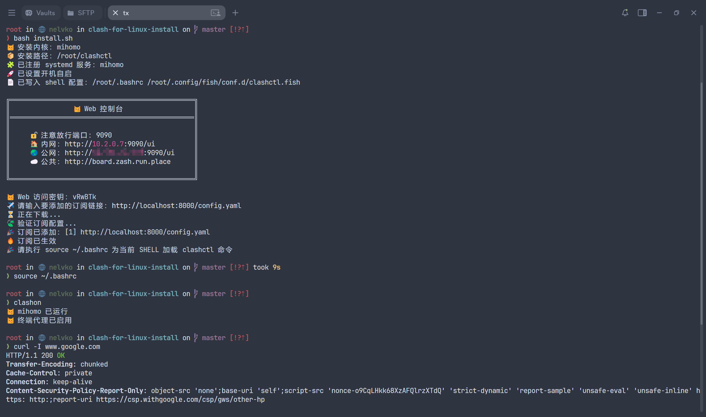

<h1 align="center">
  clashctl
</h1>

<p align="center">mihomo / clash 一键部署与管理工具</p>

<p align="center">
  
  
  
  <a href="https://deepwiki.com/nelvko/clash-for-linux-install"></a>
</p>

## 📸 Preview



## ✨ Features

- **开箱即用**：一键部署 `mihomo` / `clash` 内核、Web 面板及运行依赖。
- **广泛兼容**：支持 `root` / 普通用户，适配主流 `Linux` 发行版、容器环境及 `systemd` / `OpenRC` 等 `init` 系统。
- **统一管理**：通过 `clashctl` 管理代理启停、状态查看、日志追踪、Web 面板、TUN 模式、访问密钥与内核升级等。
- **订阅管理**：支持多订阅源配置、一键新增、切换、更新等，并集成 [subconverter](https://github.com/tindy2013/subconverter) 实现订阅格式转换。

## 🚀 Installation

在终端中执行以下命令即可完成安装：

```bash
git clone --branch master --depth 1 https://gh-proxy.org/https://github.com/nelvko/clash-for-linux-install.git \
  && cd clash-for-linux-install \
  && bash install.sh
```

- 上述命令使用了[加速前缀](https://gh-proxy.org/)，如失效请更换其他[可用链接](https://ghproxy.link/)。
- 可通过 `.env.install` 文件自定义安装选项。
- 没有订阅？[click me](https://次元.net/auth/register?code=oUbI)

## 🎯 Quick Start

安装完成后，即可使用 `clashctl` 管理代理：

```bash
clashctl on              # 开启代理
clashctl off             # 关闭代理
clashctl status          # 查看内核状态
clashctl ui              # 查看 Web 面板地址

clashctl sub add <url>   # 添加订阅
clashctl sub update      # 更新订阅
clashctl node            # 切换节点（交互式）

clashctl -h              # 查看全部命令
```

### 切换节点（`clashctl node`）

最常用的操作——在策略组之间切换节点：

```bash
# 交互式选择策略组 + 节点
clashctl node use

# 在指定策略组内交互式选节点
clashctl node use MESL

# 直接切换到指定节点（一步到位）
clashctl node use MESL "🇸🇬 新加坡 01 [0.3X]"

# 带延迟测速的交互式选择
clashctl node use -d MESL

# 列出所有策略组及当前节点
clashctl node ls

# 列出某个策略组的全部节点
clashctl node ls MESL

# 对策略组内所有节点测速
clashctl node delay MESL

# 对单个节点测速
clashctl node delay -p "🇸🇬 新加坡 01 [0.3X]"
```

> **提示**：节点名需与订阅中的名称完全一致（含 emoji、空格、`[0.3X]` 等标记）。用 `clashctl node ls <组名>` 可查看准确名称。

**常用策略组**：
- `MESL` — 主代理组，默认所有流量走此组
- `Fallback` — 自动容灾组（节点挂了自动切下一个）
- `Auto` — 自动选最快节点
- 其他按应用分类的组（`AI`、`Apple`、`Microsoft`、`Telegram` 等）可独立选节点

## 🧹 Uninstall

在项目目录下执行以下命令即可干净卸载（清除内核、配置及服务）：

```bash
bash uninstall.sh
```

## 📖 Documentation

- [Usage](https://github.com/nelvko/clash-for-linux-install/wiki) — 命令用法与示例。
- [FAQ](https://github.com/nelvko/clash-for-linux-install/wiki/FAQ) — 常见问题。

## 🧭 Custom Split-Routing: Direct Access for Specific Domains (e.g. Company Intranet)

`Mixin` applies **globally to all subscriptions** — switching or updating subscriptions always re-merges the base config with your Mixin. Add a rule to `rules.prepend` to bypass the proxy for specific domains:

```yaml
proxies:
  prepend:
    - {name: COMPANY-DIRECT, type: direct, udp: true, interface-name: eth0} # bind to the company NIC

rules:
  prepend:
    - DOMAIN-KEYWORD,company,COMPANY-DIRECT # any domain containing "company" goes direct via the company NIC
```

- `DOMAIN-KEYWORD` matches a keyword in the domain name (hits `intranet.company.com`, `xxx.company.cn`, etc.), but does **not** match URL paths.
- `prepend` rules/proxies are placed before the subscription's own entries and are matched top-down, so they take priority.
- `interface-name` forces the outbound's traffic out of the given NIC (`SO_BINDTODEVICE`), independent of the system default route. If you don't need NIC binding, just use the built-in `DIRECT` instead.

If intranet domains can only be resolved by the company DNS (symptom: intranet sites unreachable while the proxy is on, working again after `clashctl off`), also add a `dns` section to `Mixin` pointing those domains at the internal DNS servers:

```yaml
dns:
  nameserver-policy:
    "+.company.com": ["10.0.0.1#COMPANY-DIRECT", "10.0.0.2#COMPANY-DIRECT"] # replace with your company DNS
    "+.company.cn": ["10.0.0.1#COMPANY-DIRECT", "10.0.0.2#COMPANY-DIRECT"]
```

- Why: in `fake-ip` mode public DNS servers can't resolve intranet domains; `nameserver-policy` routes those lookups to the internal DNS instead.
- The `#outbound-name` suffix on a DNS server sends the query itself through that outbound. With Tun enabled, the kernel binds default egress to the default-route NIC — without this, internal DNS queries leave via the wrong interface and time out.
- Find your internal DNS servers with `resolvectl status` or `nmcli dev show <iface> | grep -i dns`.
- Editing via `clashctl mixin -e` re-merges and restarts automatically on save. Verify with: `curl -x http://127.0.0.1:7890 -I https://intranet.company.com` — a response means split-routing works.

### Advanced: NIC-Level Split (company traffic via company network, everything else via an outside network)

On a dual-NIC setup (e.g. company ethernet + personal hotspot), make the outside network the default route and pin only the intranet prefixes to the company gateway; combined with the `interface-name` outbound above, this gives physical separation:

```bash
sudo nmcli con mod "Wired connection 1" ipv4.route-metric 700 ipv4.routes "10.0.0.0/8 10.0.0.1" # company prefixes via company gateway
sudo nmcli con mod "Personal Hotspot" ipv4.route-metric 100  # personal hotspot becomes the default egress
sudo nmcli con up "Personal Hotspot" && sudo nmcli con up "Wired connection 1"
```

- Result: proxy uplinks and all ordinary traffic leave via the personal hotspot — the company network sees no VPN traffic. Only company domains (via the `COMPANY-DIRECT` bound NIC) and company intranet prefixes (static route) use the company network.
- Verify with `ss -tn`: connections from mihomo to the airport servers should show the hotspot IP as source; connections to intranet sites should show the company IP.
- Rollback: `sudo nmcli con mod "Wired connection 1" ipv4.route-metric 100 ipv4.routes ""`, set the hotspot metric back to 600, then reconnect both.

## 🔧 Troubleshooting

### 节点切换没生效？
- 确认切的是正确的策略组：`clashctl node ls` 查看各组当前节点
- 很多订阅有按应用分类的策略组（AI / Apple / Telegram 等），它们默认跟随 `MESL`，但也可独立设置
- 验证：`curl -x http://127.0.0.1:7890 https://api.ipify.org` 看出口 IP

### 开了代理后内网网站打不开
这是因为 fake-ip 模式下公网 DNS 无法解析内网域名。解决方法见上方 **Custom Split-Routing** 章节，核心两步：
1. 在 Mixin 的 `rules.prepend` 中加一条直连规则
2. 在 Mixin 的 `dns.nameserver-policy` 中指定内网 DNS

### 订阅更新失败 / 超时
- 检查网络：`clashctl off` 后能否直接访问订阅链接
- 调大 `.env` 里的超时参数：`CLASHCTL_SUB_TIMEOUT=30`
- 手动更新：`clashctl sub update`

### 节点连不上 / 速度慢
- 先测速：`clashctl node delay MESL`
- 切到延迟低的节点：`clashctl node use -d MESL`
- [0.3X] 标记的节点通常带宽较低但价格便宜，适合日常浏览；看视频/下载建议用标准节点

### 内核启动失败
- 查看日志：`clashctl log`
- 配置语法错误：通常是 Mixin 里的 YAML 格式不对，`clashctl mixin -e` 检查
- 端口被占用：`ss -tlnp | grep 7890` 查看端口占用

### Web 面板打不开
- 面板地址：`clashctl ui`
- 确认内核在运行：`clashctl status`
- 外部访问需 `allow-lan: true`（在 Mixin 中设置），并配置 `secret` 以防未授权访问

## 💖 Support

###  [Maru Code —— 稳定可靠的 API 中转服务](https://api.muteki.site/register?aff=NELVKO&promo=nelvko)

- ⚡ 模型能力完整，`Claude` 系列满血可用。
- 📊 计费倍率透明公开，成本更容易预估。
- 🔑 自营号池保障可用性，日常调用更稳定。
- 🎁 新用户注册赠送 `$2` 额度：👉[立即注册](https://api.muteki.site/register?aff=NELVKO&promo=nelvko)

## ⭐ Star History

<a href="https://star-history.dera.page/#nelvko/clash-for-linux-install&Date">
 <picture>
   <source media="(prefers-color-scheme: dark)" srcset="https://star-history.dera.page/svg?repos=nelvko/clash-for-linux-install&type=Date&theme=dark" />
   <source media="(prefers-color-scheme: light)" srcset="https://star-history.dera.page/svg?repos=nelvko/clash-for-linux-install&type=Date" />
   
 </picture>
</a>

## ⚠️ Disclaimer

- 编写本项目主要目的为学习和研究 `Shell` 编程，不得将本项目中任何内容用于违反国家/地区/组织等的法律法规或相关规定的其他用途。
- 本项目保留随时对免责声明进行补充或更改的权利，直接或间接使用本项目内容的个人或组织，视为接受本项目的特别声明。
