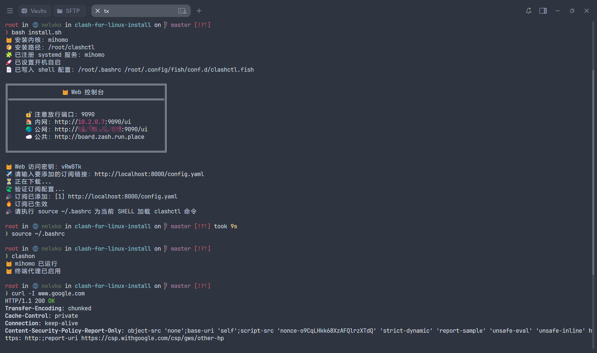

<h1 align="center">
  clashctl
</h1>

<p align="center">mihomo / clash 一键部署与管理工具</p>

<p align="center">
  
  
  
  <a href="https://deepwiki.com/nelvko/clash-for-linux-install"></a>
</p>

## 📸 Preview



## ✨ Features

- **开箱即用**：一键部署 `mihomo` / `clash` 内核、Web 面板及运行依赖。
- **广泛兼容**：支持 `root` / 普通用户，适配主流 `Linux` 发行版、容器环境及 `systemd` / `OpenRC` 等 `init` 系统。
- **统一管理**：通过 `clashctl` 管理代理启停、状态查看、日志追踪、Web 面板、TUN 模式、访问密钥与内核升级等。
- **订阅管理**：支持多订阅源配置、一键新增、切换、更新等，并集成 [subconverter](https://github.com/tindy2013/subconverter) 实现订阅格式转换。

## 🚀 Installation

在终端中执行以下命令即可完成安装：

```bash
git clone --branch master --depth 1 https://gh-proxy.org/https://github.com/nelvko/clash-for-linux-install.git \
  && cd clash-for-linux-install \
  && bash install.sh
```

- 上述命令使用了[加速前缀](https://gh-proxy.org/)，如失效请更换其他[可用链接](https://ghproxy.link/)。
- 可通过 `.env.install` 文件自定义安装选项。
- 没有订阅？[click me](https://次元.net/auth/register?code=oUbI)

## 🎯 Quick Start

安装完成后，即可使用 `clashctl` 管理代理：

```bash
clashctl on              # 开启代理
clashctl off             # 关闭代理
clashctl status          # 查看内核状态
clashctl ui              # 查看 Web 面板地址

clashctl sub add <url>   # 添加订阅
clashctl sub update      # 更新订阅
clashctl node            # 切换节点（交互式）

clashctl -h              # 查看全部命令
```

### 切换节点（`clashctl node`）

最常用的操作——在策略组之间切换节点：

```bash
# 交互式选择策略组 + 节点
clashctl node use

# 在指定策略组内交互式选节点
clashctl node use MESL

# 直接切换到指定节点（一步到位）
clashctl node use MESL "🇸🇬 新加坡 01 [0.3X]"

# 带延迟测速的交互式选择
clashctl node use -d MESL

# 列出所有策略组及当前节点
clashctl node ls

# 列出某个策略组的全部节点
clashctl node ls MESL

# 对策略组内所有节点测速
clashctl node delay MESL

# 对单个节点测速
clashctl node delay -p "🇸🇬 新加坡 01 [0.3X]"
```

> **提示**：节点名需与订阅中的名称完全一致（含 emoji、空格、`[0.3X]` 等标记）。用 `clashctl node ls <组名>` 可查看准确名称。

**常用策略组**：
- `MESL` — 主代理组，默认所有流量走此组
- `Fallback` — 自动容灾组（节点挂了自动切下一个）
- `Auto` — 自动选最快节点
- 其他按应用分类的组（`AI`、`Apple`、`Microsoft`、`Telegram` 等）可独立选节点

## 🧹 Uninstall

在项目目录下执行以下命令即可干净卸载（清除内核、配置及服务）：

```bash
bash uninstall.sh
```

## 📖 Documentation

- [Usage](https://github.com/nelvko/clash-for-linux-install/wiki) — 命令用法与示例。
- [FAQ](https://github.com/nelvko/clash-for-linux-install/wiki/FAQ) — 常见问题。

## 🧭 Custom Split-Routing: Streaming Over Wired, Everything Else Over WiFi

`Mixin` applies **globally to all subscriptions** — switching or updating subscriptions
always re-merges the base config with your Mixin. The shipped `resources/mixin.yaml`
contains a fill-in-the-blanks template implementing this provider-agnostic policy:

1. **On-net/intranet streaming** (any host matching your keyword, e.g. `midea`)
   → **wired NIC, always DIRECT**, never via a VPN provider node.
2. **All other streaming** → **WiFi NIC**. Whether it additionally exits through a
   VPN node depends solely on clashctl's on/off state, mode (Rule/Global/Direct) and
   proxy-group selection — the Mixin references no provider, so it works with **any
   subscription on any machine**.

Per-host setup (find interface names with `ip -o link show`):

```yaml
# global default egress = WiFi: proxy nodes (VPN transport), ordinary DIRECT and DNS
interface-name: wlan0                       # <- WIFI_NIC

proxies:
  prepend:
    # direct outbound pinned to the wired NIC (own interface-name overrides the global one)
    - {name: WIRED-DIRECT, type: direct, udp: true, interface-name: eth0} # <- WIRED_NIC

rules:
  prepend:
    # on-net streaming is matched first and forced direct over the wired NIC
    - DOMAIN-KEYWORD,midea,WIRED-DIRECT     # <- STREAM_KEYWORD
    - DOMAIN-SUFFIX,midea.com,WIRED-DIRECT
    - IP-CIDR,10.0.0.5/32,WIRED-DIRECT,no-resolve # pin streaming server IPs as needed
```

- `DOMAIN-KEYWORD` matches a keyword in the domain name (hits `stream.midea.com`,
  `midea.cn`, etc.) but **not** URL paths; use `DOMAIN-SUFFIX`/`IP-CIDR` for exact scope.
- `prepend` rules/proxies are placed before the subscription's own entries and matched
  top-down, so they win even when the VPN provider is ON and a node is selected elsewhere.
- `interface-name` forces egress via `SO_BINDTODEVICE`, independent of the system default
  route, so on-net streaming can never leak onto WiFi. Single-NIC hosts can skip it and
  use the built-in `DIRECT`.
- **clashctl ON (Rule mode):** other streaming goes WiFi and may traverse the selected
  provider node per the subscription rules. **clashctl OFF:** clashctl no longer manages
  traffic at all — the operating system's own routes apply, so make WiFi the OS default
  route for the non-on-net policy to hold outside the proxy too. **Global/Direct modes:**
  egress follows the chosen mode; the wired-bound on-net rules above still take precedence.

If on-net domains can only be resolved by internal DNS (symptom: unreachable while the
proxy is on, working after `clashctl off`), add a `dns` policy:

```yaml
dns:
  nameserver-policy:
    "+.midea.com": ["10.0.0.1#WIRED-DIRECT", "10.0.0.2#WIRED-DIRECT"] # <- internal DNS
```

- Why: in `fake-ip` mode public DNS can't resolve intranet domains; `nameserver-policy`
  routes those lookups to the internal resolvers.
- The `#outbound-name` suffix sends the query itself through that outbound. With Tun
  enabled, default egress otherwise leaves via the WiFi NIC and internal lookups time out.
- Find internal DNS with `resolvectl status` or `nmcli dev show <WIRED_NIC> | grep -i dns`.
- Editing via `clashctl mixin -e` re-merges and restarts automatically on save.

### Advanced: Host-Route Metrics for Dual Uplinks

On a dual-NIC setup, make WiFi the default route and pin only intranet prefixes to the
wired gateway, so non-on-net traffic — including provider uplinks — has a deterministic
physical path even when clashctl is off:

```bash
sudo nmcli con mod "Wired connection 1" ipv4.route-metric 700 ipv4.routes "10.0.0.0/8 10.0.0.1"
sudo nmcli con mod "Personal Hotspot" ipv4.route-metric 100  # WiFi becomes the default egress
sudo nmcli con up "Personal Hotspot" && sudo nmcli con up "Wired connection 1"
```

- Result: provider nodes and ordinary traffic leave via WiFi — the wired network sees no
  VPN traffic; only `WIRED-DIRECT` domains and pinned intranet prefixes use the wired NIC.
- Verify with `ss -tn`: mihomo→provider sockets show the WiFi IP as source; on-net streams
  show the wired IP. Rollback: clear the static route and restore both metrics to 100/600.

## ☁️ Chinese Cloud Drives: Always Direct (AliYunPan, BaiduNetdisk, …)

Chinese cloud drives host both their control API and upload/download (CDN/object-store)
nodes on **mainland-China IPs**. Sending that traffic out through a proxy node is pure
cost — extra RTT, and on rate-limited nodes (those tagged `[0.3X]`) a hard throughput cap —
so the default `mixin.yaml` pins these services to `DIRECT`:

| Service | Domains forced DIRECT |
|---|---|
| AliYunPan 阿里云盘 | `alipan.com`, `aliyundrive.com` |
| BaiduNetdisk 百度网盘 | `baidupcs.com`, `pan.baidu.com`, `bdimg.com` |
| Quark 夸克网盘 | `quark.cn` |
| TianYi 天翼云盘 | `189.cn`, `189cloud.com` |
| 115 网盘 | `115.com` |
| ChengTong 城通网盘 | `ctfile.com`, `ctfile.net` |
| XunLei 迅雷云盘 | `pan.xunlei.com`, `xunlei.com` |
| Weiyun 腾讯微云 | `weiyun.com` |

These live in `rules.prepend`, which the merge splices **ahead of every subscription's own
rules**, so they are deterministic regardless of which subscription is active or how its
rules are ordered. In practice the subscription's `GEOIP,cn` fallback already routes most
of them direct; the explicit rules only make that intent explicit and order-independent.

> **Egress NICs.** These drive rules target plain `DIRECT`; the physical NIC that uses
> follows the global default (`interface-name`) unless an outbound pins it elsewhere.
> On a dual-NIC host configured for the streaming policy, see **Custom Split-Routing**
> above: on-net streaming (e.g. Midea) is pinned to wired, while these drives and all
> other traffic egress over the WiFi default route.

> **"When the IP is already in China."** `DIRECT` here means no proxy *node*. The decision
> is domain-based for determinism; if one of these services ever resolves to an overseas CDN
> PoP you'd rather proxy, remove its explicit rule and let `GEOIP,cn` decide on the resolved
> destination instead. Verify what actually matched a connection in the Web UI or with
> `clashctl log`.

### Known limitation — TUN mode is not bypassed (deferred)

When **TUN mode** is enabled (`tun.enable: true`), all traffic still *enters* the mihomo
stack via the `Meta` virtual NIC and fake-IP DNS (`198.18.0.0/16`), even for the services
above. They exit via the `DIRECT` chain (verified: `chains=['DIRECT']`, real China IPs), so no
proxy **node** is used — but the packets are still processed by the kernel, adding a small
per-connection overhead. Fully bypassing TUN for these domains (e.g. `tun.route-exclude-address`
/ routing their real IPs before the TUN default route) is **not implemented yet** and was
deprioritized. Revisit if the per-connection overhead ever shows up in profiling.

Verify direct routing of a drive host:

```bash
# rule output should name DIRECT (or a direct outbound), with a China destination IP
curl -s -H "Authorization: Bearer $SECRET" http://127.0.0.1:9090/connections \
  | grep -E 'alipan|baidupcs'
```

## 🔧 Troubleshooting

### 节点切换没生效？
- 确认切的是正确的策略组：`clashctl node ls` 查看各组当前节点
- 很多订阅有按应用分类的策略组（AI / Apple / Telegram 等），它们默认跟随 `MESL`，但也可独立设置
- 验证：`curl -x http://127.0.0.1:7890 https://api.ipify.org` 看出口 IP

### 开了代理后内网网站打不开
这是因为 fake-ip 模式下公网 DNS 无法解析内网域名。解决方法见上方 **Custom Split-Routing** 章节，核心两步：
1. 在 Mixin 的 `rules.prepend` 中加一条直连规则
2. 在 Mixin 的 `dns.nameserver-policy` 中指定内网 DNS

### 订阅更新失败 / 超时
- 检查网络：`clashctl off` 后能否直接访问订阅链接
- 调大 `.env` 里的超时参数：`CLASHCTL_SUB_TIMEOUT=30`
- 手动更新：`clashctl sub update`

### 节点连不上 / 速度慢
- 先测速：`clashctl node delay MESL`
- 切到延迟低的节点：`clashctl node use -d MESL`
- [0.3X] 标记的节点通常带宽较低但价格便宜，适合日常浏览；看视频/下载建议用标准节点

### 内核启动失败
- 查看日志：`clashctl log`
- 配置语法错误：通常是 Mixin 里的 YAML 格式不对，`clashctl mixin -e` 检查
- 端口被占用：`ss -tlnp | grep 7890` 查看端口占用

### Web 面板打不开
- 面板地址：`clashctl ui`
- 确认内核在运行：`clashctl status`
- 外部访问需 `allow-lan: true`（在 Mixin 中设置），并配置 `secret` 以防未授权访问

## 💖 Support

###  [Maru Code —— 稳定可靠的 API 中转服务](https://api.muteki.site/register?aff=NELVKO&promo=nelvko)

- ⚡ 模型能力完整，`Claude` 系列满血可用。
- 📊 计费倍率透明公开，成本更容易预估。
- 🔑 自营号池保障可用性，日常调用更稳定。
- 🎁 新用户注册赠送 `$2` 额度：👉[立即注册](https://api.muteki.site/register?aff=NELVKO&promo=nelvko)

## ⭐ Star History

<a href="https://star-history.dera.page/#nelvko/clash-for-linux-install&Date">
 <picture>
   <source media="(prefers-color-scheme: dark)" srcset="https://star-history.dera.page/svg?repos=nelvko/clash-for-linux-install&type=Date&theme=dark" />
   <source media="(prefers-color-scheme: light)" srcset="https://star-history.dera.page/svg?repos=nelvko/clash-for-linux-install&type=Date" />
   
 </picture>
</a>

## ⚠️ Disclaimer

- 编写本项目主要目的为学习和研究 `Shell` 编程，不得将本项目中任何内容用于违反国家/地区/组织等的法律法规或相关规定的其他用途。
- 本项目保留随时对免责声明进行补充或更改的权利，直接或间接使用本项目内容的个人或组织，视为接受本项目的特别声明。
